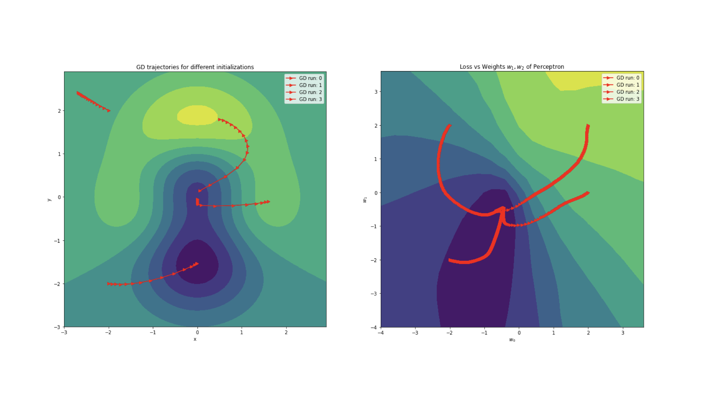

# Autograd: Automatic Differentiation from Scratch
Look at the [demo notebook](/demo.ipynb) for a quick introduction to autograd.



## What does it do?
Automatic differentiation is a technique for computing derivatives of arbitrary nested functions. When these functions are differentiable, one can apply the chain rule to compute the derivatives with respect to function parameters or inputs.

To do so, the underlying function is represented as a computational graph, where each node is a variable and the edges represent the mathematical operations applied to these variables. To compute the derivatives of the function, there are two main operations: forward pass and reverse accumulation of the derivatives (backpropagation).

I implemented these the following way.
### Forward pass:
- All the mathematical operations between variables of type *Variable* are treated specially and a computational graph of these nested operations is built.
- In the process all the intermediate variables are computed and saved (for each node in the graph).
- The graph is therefore constructed dynamically.

### Reverse accumulation:
- The derivatives of the function are computed by traversing the graph in reverse order and accumulating the derivatives of the intermediate variables.
- This can be called on any arbitrary node in the graph, and the derivatives of the function with respect to the node's value are computed.

This combination of forward pass and reverse accumulation is the typical approach to train neural networks. Although the basic approach extends to other optimization problems in general.

## Description of the code
The code structure looks as follows. The main file is *autograd.py*, which contains the *Variable* class and the mathematical operations. Each mathematical operation is represented as a class, that has a forward pass method and a derivative method, to allow for the computation of local gradients. The *test.py* file contains gradient checking with PyTorch.
```
autogradengine
│   README.md
│   .gitignore
│   requirements.txt
│   demo.ipynb   # Jupyter notebook with application examples
│
└───autograd   
│   │   __init__.py    # bread and butter of the engine
│   │   nn.py          # neural network modules
│   │   optimizer.py
│   │   test.py        # gradient checking
│ 
└───imgs
    │   ...
 
```


### Analogues to PyTorch
The API follows the PyTorch API loosely. The following are analogues to each other:
- *autograd.Variable* <=> *torch.Tensor*
- *autograd.Module* <=> *torch.nn.Module*