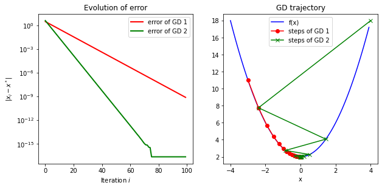
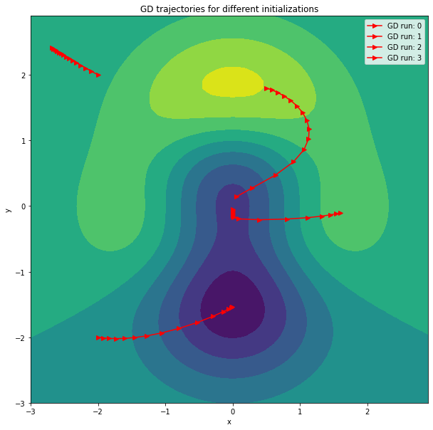
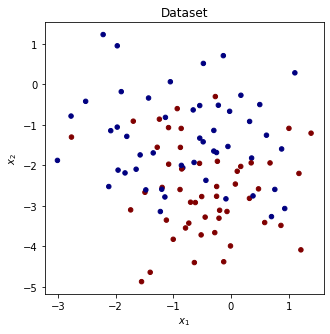
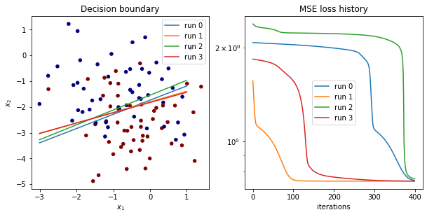
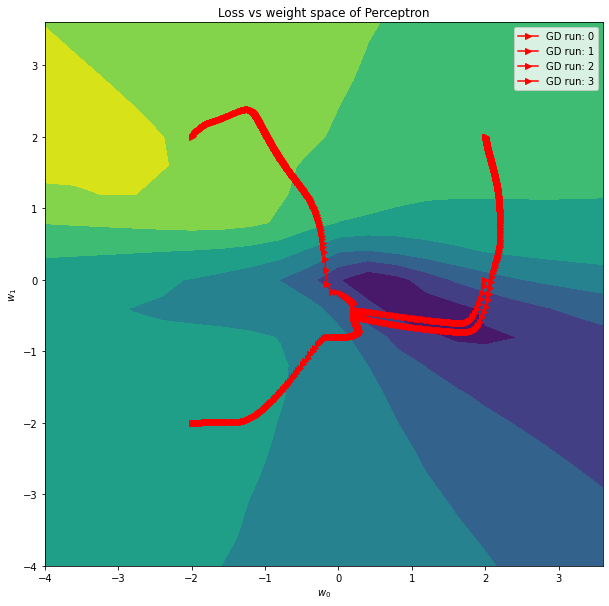

# Autograd Demo
This is a demo of my *autograd* repository. To shortly describe what it is:
- *autograd* is a automatic differentiation framework that allows for calculating the gradients of a wide range of mathematical expressions (not just neural networks)
- This can be used to for optimization by doing backpropagation
- It is basically a boiled down analog to pytorch and also follows pytorch's syntax 


```python
import autograd
from autograd.optimizer import GD

import numpy as np
import torch
import math

import random
import time

from mpl_toolkits.mplot3d import Axes3D
import matplotlib.pyplot as plt
import pylab
plt.rcParams["figure.figsize"] = (10,10)
```

# Comparing autograd and PyTorch 
To introduce the API and to check how well *autograd* works we compute the gradient with respect to $x$ of the messy function 
> $$f(x) := ((x-2)^{2/x}-1)^{x-1}$$

and compare it with the gradient PyTorch would give us. To run more gradient checking tests, you can run the **test.py** script located at "autogradengine/autograd/test.py".


```python
def gradient_test_f(x):
    return ((x - 3.)**(2./x) - 1) ** (x - 1.)

# Compute gradient df/dx at x=1 using torch
torch_x = torch.Tensor([10.])
torch_x.requires_grad = True

torch_time = time.time()
torch_y = gradient_test_f(torch_x)
torch_y.backward()
torch_time = time.time() - torch_time

torch_grad = torch_x.grad

# Compute gradient df/dx at x=1 using autograd
autograd_x = autograd.Variable(10.)

autograd_time = time.time()
autograd_y = gradient_test_f(autograd_x)
autograd_y.backward()
autograd_time = time.time() - autograd_time

autograd_grad = autograd_x.grad

print(
    f"torch gradient {torch_grad.item():.5f} in {torch_time:.5f}s\nautograd gradient: {autograd_grad.item():.5f} in {autograd_time:.5f}s")
if math.isclose(torch_grad, autograd_grad, abs_tol=1e-5):
    print("\nThe packages agree!")
```

    torch gradient -0.00129 in 0.00320s
    autograd gradient: -0.00129 in 0.00051s
    
    The packages agree!


# Simple Example: Minimizing Quadratic Function
As a first simple demo example, we use the autograd engine to solve the minimization problem
> $$x^*=\text{argmin}\left[(x-2)^2+4x-2\right]$$


```python
# Defining the function to be optimized
def f(x):
    return (x-2)**2 + 4*x - 2
    

# autograd.Module is analog to torch.nn.Module
class QuadrFuncMod(autograd.Module):
    def __init__(self, init):
        super(QuadrFuncMod, self).__init__()
        self.x = autograd.Variable(init)
    
    def forward(self):
        return f(self.x) 
    

# Iteratively computing forward pass, backward pass and then doing a gradient step
def perform_gd(initializations, lrs, epochs=100):
    n_runs = len(initializations)
    print(f"Performing GD for {n_runs} runs with different initializations:")
    
    func_value_history = []
    x_value_history = []
    
    for run in range(n_runs):
        print(f"\nStarting run {run} with x_0={initializations[run]}")
        func_value_history.append([])
        x_value_history.append([])
            
        module = QuadrFuncMod(initializations[run])
        optim = GD(params=module.collect_parameters(), lr=lrs[run])

        for epoch in range(epochs):
            
            x_value_history[run].append(float(module.x.value.squeeze()))

            # Set the gradient of all parameters to zero
            optim.zero_grad()

            # Forward pass constructs computational graph dynamically
            func_value = module.forward()

            # Like in pytorch: simply call backward pass on optimization criterion 
            # This performs backpropagation through the computational graph
            func_value.backward()  

            # Optimizer reads out gradients of all parameters and performs on gradient step
            optim.step()

            func_value_history[run].append(func_value.value.squeeze())
            if epoch % 25 == 0:
                print(f"epoch: {epoch} | x: {module.x.value.squeeze():.3f} | f(x): {func_value.value.squeeze():.3f}")
            
    return np.array(x_value_history), np.array(func_value_history)
```


```python
# Perform optimization
initializations = [-3, 4]
learning_rates = [0.1, 0.8]
x_value_history, func_value_history = perform_gd(initializations, learning_rates)
```

    Performing GD for 2 runs with different initializations:
    
    Starting run 0 with x_0=-3
    epoch: 0 | x: -2.400 | f(x): 11.000
    epoch: 25 | x: -0.009 | f(x): 2.000
    epoch: 50 | x: -0.000 | f(x): 2.000
    epoch: 75 | x: -0.000 | f(x): 2.000
    
    Starting run 1 with x_0=4
    epoch: 0 | x: -2.400 | f(x): 18.000
    epoch: 25 | x: 0.000 | f(x): 2.000
    epoch: 50 | x: -0.000 | f(x): 2.000
    epoch: 75 | x: -0.000 | f(x): 2.000


```python
fig = plt.figure()

# plot GD trajectory
ax2 = fig.add_subplot(2, 2, 2)
x_range = np.arange(-4, 4, .1)
ax2.plot(x_range, f(x_range), label='f(x)', color='b')
ax2.plot(x_value_history[0], func_value_history[0], '-o', color='r', label='steps of GD 1')
ax2.plot(x_value_history[1], func_value_history[1], '-x', color='g', label='steps of GD 2')

plt.legend()
plt.title("GD trajectory")
plt.xlabel("x")

# plot error 
x_star = 0  # analytical solution to minization problem
error = np.abs(x_value_history - x_star)
ax1 = fig.add_subplot(2, 2, 1)
line, = ax1.plot(error[0], color='r', lw=2, label='error of GD 1')
line, = ax1.plot(error[1], color='g', lw=2, label='error of GD 2')
ax1.set_yscale('log')
plt.title('Evolution of error')
plt.xlabel('Iteration $i$')
plt.ylabel('$|x_i-x^*|$')
plt.legend()

pylab.show()
```


    

    


The visualization shows that the algorithm converged exponentially and converges to the global optimum, which was expected for a quadratic function.

# Multivariate Minimization
In the follwing, the autograd engine is applied to a multivariate minimization problem. The basic principle is the same as in the previous example, however here the optimization regime is $\mathbb R^2$, as we optimize over $x$ and $y$. The minimization problem will be 
> $$x^*, y^* = \text{argmin}\left[{((x^2+y^3)-1) \cdot \exp{(-0.5{(x^2+y^2)})}}\right],$$

which is non-convex.


```python
def z_func(x,y):
    return -(1-(x**2+y**3))*np.exp(-(x**2+y**2)/2)
    

class MulVariableMod(autograd.Module):
    def __init__(self, init_x, init_y):
        super(MulVariableMod, self).__init__()
        self.x = autograd.Variable(init_x) 
        self.y = autograd.Variable(init_y) 
        self.exp = autograd.Exp()  # autograd supports a range of nonlinearities

        print(f"\nStarting initialization: x={self.x.value.squeeze()}, y={self.y.value.squeeze()}")
        self.params = self.collect_parameters()
    
    def forward(self):
        return -(1-(self.x**2+self.y**3))*self.exp(-(self.x**2+self.y**2)/2)
    
    
def perform_2d_gd(initializations, epochs=15):
    n_runs = len(initializations)
    print(f"Performing GD for {n_runs} runs with different initializations:")

    # initializations have shape [runs, 2]
    func_value_history = []  # collecting lists should have shape [runs, epochs] after loop 
    x_value_history = []
    y_value_history = []
    
    for run in range(n_runs):
        module = MulVariableMod(init_x=initializations[run][0], 
                                init_y=initializations[run][1])
        optim = GD(params=module.collect_parameters(), lr=0.3)
        
        func_value_history.append([])
        x_value_history.append([])
        y_value_history.append([])

        for epoch in range(epochs):
            x_value_history[run].append(float(module.x.value))
            y_value_history[run].append(float(module.y.value)) 

            optim.zero_grad()
            func_value = module.forward()
            func_value.backward()
            optim.step()

            func_value_history[run].append(func_value.value)
            if epoch % 5 == 0:
                print(f"   epoch: {epoch} | x: {module.x.value.squeeze():.3f} | y: {module.y.value.squeeze():.3f} | f(x): {func_value.value.squeeze():.3f}")            
    return np.array(x_value_history), np.array(y_value_history), np.array(func_value_history)
```


```python
# Perform optimization on multiple starting initializations
initializations = [[0.5, 1.8],
                  [-2, -2], 
                  [-2, 2], 
                  [1.6, -0.1]]
x_value_history, y_value_history, func_value_history = perform_2d_gd(initializations, epochs=15)
```

    Performing GD for 4 runs with different initializations:
    
    Starting initialization: x=0.5, y=1.8
       epoch: 0 | x: 0.581 | y: 1.770 | f(x): 0.888
       epoch: 5 | x: 1.037 | y: 1.426 | f(x): 0.686
       epoch: 10 | x: 0.903 | y: 0.674 | f(x): 0.298
    
    Starting initialization: x=-2.0, y=-2.0
       epoch: 0 | x: -1.923 | y: -2.011 | f(x): -0.092
       epoch: 5 | x: -1.272 | y: -1.979 | f(x): -0.323
       epoch: 10 | x: -0.135 | y: -1.608 | f(x): -1.322
    
    Starting initialization: x=-2.0, y=2.0
       epoch: 0 | x: -2.099 | y: 2.055 | f(x): 0.201
       epoch: 5 | x: -2.425 | y: 2.249 | f(x): 0.079
       epoch: 10 | x: -2.606 | y: 2.362 | f(x): 0.043
    
    Starting initialization: x=1.6, y=-0.1
       epoch: 0 | x: 1.541 | y: -0.115 | f(x): 0.431
       epoch: 5 | x: 0.397 | y: -0.209 | f(x): -0.259
       epoch: 10 | x: 0.000 | y: -0.100 | f(x): -0.994


Function and plot taking from here: [Link](https://glowingpython.blogspot.com/2012/01/how-to-plot-two-variable-functions-with.html)


```python
# Plot the GD trajectories
x = np.arange(-3.0,3.0,0.1)
y = np.arange(-3.0,3.0,0.1)
[X, Y] = np.meshgrid(x, y)
fig, ax = plt.subplots(1, 1)
Z = z_func(X,Y)
ax.contourf(X, Y, Z)  
ax.set_xlabel('x')
ax.set_ylabel('y')
for run in range(x_value_history.shape[0]):
    plt.plot(x_value_history[run], y_value_history[run], '->', color='r', label=f'GD run: {run}')
plt.title("GD trajectories for different initializations")
plt.legend()
plt.show()
```


    

    


We can nicely see that the GD trajectories are orthogonal to the contour lines. Furthermore, not all runs converge to the global minimum, which is due to the the loss function not being convex.

# Perceptron
Let us move into the direction of neural networks and train an adaption of the Perceptron. The goal is to perform a simple two class classification problem on the dataset of inputs $X = \{x_i\}$ and labels $Y = \{y_i\}$. Our Perceptron model has the form 
> $$f_{w,b}(x) = \tanh(w^Tx+b)$$

We train it to minimize the MSE loss between its prediction $\hat y = f_{w,b}(x)$ and the given label $y$,
> $$l(\hat y, y) = (\hat y - y)^2 = \left(\tanh(w^Tx+b) - y\right)^2.$$

So we finally have the optimization problem
> $$w^*, b^* = \text{argmin}_{w, b} \left[ \sum_{x \in X, y \in Y}\left(\tanh(w^Tx+b) - y\right)^2\right]$$.

The gradients of the objective will be computed with autograd and the model then trained with backpropagation.


```python
# load simple two class dataset
from sklearn.datasets import make_blobs

x_data, y_data = make_blobs(n_samples=100, centers=2, n_features=2, center_box=(-4, 4))
y_data = 2*y_data - 1
plt.figure(figsize=(5,5))
plt.scatter(x_data[:,0], x_data[:,1], c=y_data, s=20, cmap='jet')
plt.title('Dataset')
plt.xlabel('$x_1$'), plt.ylabel('$x_2$')
plt.show()
```


    

    


```python
# function to train multiple perceptrons with different starting initializations
from autograd.nn import Dataset, Perceptron

def perform_gd_perceptron(dataset, weight_initializations):
    loss_hist = []
    weight_hist = []
    bias_hist = []

    n_runs = weight_initializations.shape[0]
    for run in range(n_runs):
        # Train the Perceptron
        print(f"\nTraining perceptron {run} with initialization w={weight_initializations[run]}")
        epochs = 400
        loss_hist.append([])
        weight_hist.append([])
        bias_hist.append([])

        perceptron = Perceptron(output_size=1, input_size=2)
        perceptron.linear.weight.value = weight_initializations[run].reshape(1, 2).copy()
        optimizer = GD(params=perceptron.collect_parameters(), lr=0.1)

        for epoch in range(epochs):
            weight_hist[run].append(perceptron.linear.weight.value.squeeze().copy().tolist())
            bias_hist[run].append(perceptron.linear.bias.value.squeeze().copy().tolist())

            optimizer.zero_grad()
            loss = perceptron.forward_dataset(dataset, mseloss)
            loss.backward()
            optimizer.step()

            loss_hist[run].append(float(loss.value.item()))
            if epoch % 100 == 0:
                print(f"epoch: {epoch} | loss:{loss.value.squeeze():.4f}")

    return np.array(weight_hist, dtype=object), np.array(bias_hist, dtype=object), np.array(loss_hist)
```


```python
# Define dataset, loss and different starting initializations
dataset = Dataset(x_data.reshape(-1 , 2, 1), y_data.reshape(-1, 1, 1))
mseloss = autograd.MSELoss()
weight_initializations = np.array([[2., 2.], [2., 0.], [-2., 2.], [-2., -2.]], dtype=float)

weight_hist, bias_hist, loss_hist = perform_gd_perceptron(dataset, weight_initializations)
final_weights = weight_hist[:, -1, :]
```

    
    Training perceptron 0 with initialization w=[2. 2.]
    epoch: 0 | loss:2.0720
    epoch: 100 | loss:2.0394
    epoch: 200 | loss:1.9897
    epoch: 300 | loss:1.0919
    
    Training perceptron 1 with initialization w=[2. 0.]
    epoch: 0 | loss:1.5633
    epoch: 100 | loss:0.7534
    epoch: 200 | loss:0.7460
    epoch: 300 | loss:0.7459
    
    Training perceptron 2 with initialization w=[-2.  2.]
    epoch: 0 | loss:2.3774
    epoch: 100 | loss:2.2238
    epoch: 200 | loss:2.2124
    epoch: 300 | loss:2.1687
    
    Training perceptron 3 with initialization w=[-2. -2.]
    epoch: 0 | loss:1.8339
    epoch: 100 | loss:1.5601
    epoch: 200 | loss:0.7684
    epoch: 300 | loss:0.7504


```python
# Let's visualize results
fig = plt.figure()
ax1 = fig.add_subplot(2, 2, 1)

# plot learnt decision boundaries
x_range = np.arange(min(x_data[:,0]), max(x_data[:,0]))
ax1.scatter(x_data[:,0], x_data[:,1], c=y_data, s=20, cmap='jet')

for i, w in enumerate(final_weights):
    decision_boundary = -(w[0]/w[1])*x_range - bias_hist[i, -1]/w[1]
    ax1.plot(x_range, decision_boundary, label=f'run {i}')
plt.title('Decision boundary')
plt.xlabel('$x_1$')
plt.ylabel('$x_2$')
plt.legend()

# plot loss
ax2 = fig.add_subplot(2, 2, 2)
for i, loss in enumerate(loss_hist):
    ax2.plot(loss, label=f'run {i}')
plt.title('MSE loss history')
plt.legend()
plt.xlabel('iterations')
plt.yscale('log')

plt.show()
```


    

    


```python
# loss as function of perceptron weight parameters
def weight_to_loss(w0s, w1s):
    perceptron = Perceptron(output_size=1, input_size=2)
    i_max, j_max = w0s.shape
    Z = np.zeros(w0s.shape)
    for i in range(i_max):
        for j in range(j_max):
            perceptron.linear.weight.value[0, 0] = w0s[i, j]
            perceptron.linear.weight.value[0, 1] = w1s[i, j]
            Z[i, j] =  perceptron.forward_dataset(dataset, mseloss).value.squeeze()
    return Z
```


```python
# Compute loss for a mesh of weight values
x = np.arange(-4.0,4.0,0.4)
y = np.arange(-4.0,4.0,0.4)
[X, Y] = np.meshgrid(x, y)
Z = weight_to_loss(X,Y)
```


```python
# Plot the GD trajectories in weight space
fig, ax = plt.subplots(1, 1)
ax.contourf(X, Y, Z) 
for i, w in enumerate(weight_hist):
    ax.plot(w[:, 0], w[:, 1], '->', color='r', label=f'GD run: {i}')
ax.set_xlabel('$w_0$')
ax.set_ylabel('$w_1$')
plt.title("Loss vs weight space of Perceptron")
plt.legend()
plt.show()
```


    

    


```python

```
